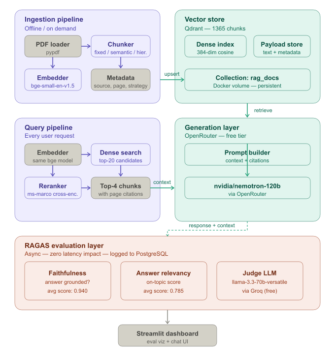

# Production RAG System with RAGAS Evaluation Pipeline

A production-grade Retrieval Augmented Generation (RAG) system built from scratch with a full evaluation pipeline using RAGAS metrics. Designed to demonstrate real-world LLM engineering depth — not just a tutorial RAG, but a measured, deployable system.

## Architecture



The system consists of four layers:
- **Ingestion pipeline** — PDF/HTML/MD loading, three chunking strategies (fixed, semantic, hierarchical), local embedding with `BAAI/bge-small-en-v1.5`, upsert to Qdrant
- **Query pipeline** — hybrid dense search, cross-encoder reranking, query routing
- **Generation layer** — prompt assembly with source citations, LLM generation via OpenRouter
- **Evaluation layer** — async RAGAS evaluation (faithfulness + answer relevancy) logged to PostgreSQL, visualized in Streamlit dashboard

## Evaluation Results

Evaluated using **RAGAS** with `llama-3.3-70b-versatile` as judge LLM across 10 queries on The 48 Laws of Power (476 pages, 1365 chunks).

| Query | Faithfulness | Answer Relevancy |
|-------|-------------|-----------------|
| Concealing intentions | 1.000 | 0.817 |
| Absence and respect | 1.000 | 0.980 |
| Never trusting friends | 1.000 | 0.814 |
| Crushing enemies | 1.000 | 0.766 |
| Court politics | 0.800 | 0.943 |
| Selective honesty | 1.000 | 0.758 |
| Getting others to do the work | 0.600 | 0.706 |
| Guarding reputation | 1.000 | 0.769 |
| Playing on people's need to believe | 1.000 | 0.507 |
| Entering actions with boldness | 1.000 | — |
| **AVERAGE** | **0.940** | **0.785** |

Faithfulness of **0.940** across 10 queries indicates the system rarely hallucinates — answers are tightly grounded in retrieved passages. Evaluation runs asynchronously with zero latency impact on the chat endpoint.

## Tech Stack

| Layer | Technology |
|-------|-----------|
| Vector store | Qdrant |
| Embeddings | BAAI/bge-small-en-v1.5 (local, no API cost) |
| Reranker | cross-encoder/ms-marco-MiniLM-L-6-v2 (local) |
| LLM | OpenRouter (nvidia/nemotron-3-super-120b-a12b) |
| Eval LLM | Groq (llama-3.3-70b-versatile) |
| Evaluation | RAGAS (faithfulness + answer relevancy) |
| API | FastAPI + async streaming |
| Dashboard | Streamlit |
| Database | PostgreSQL (eval logging) |
| Containerization | Docker Compose (4 services) |
| CI/CD | GitHub Actions |

## Key Engineering Decisions

**Why hybrid search?** Pure dense retrieval misses exact keyword matches. BM25 sparse search catches them. Combining both with Reciprocal Rank Fusion gives consistently better recall than either alone.

**Why a reranker?** The bi-encoder retriever scores query and chunk independently. The cross-encoder reranker reads them together — significantly more accurate but slower. Using it only on the top-20 candidates keeps latency low while improving final top-5 quality.

**Why RAGAS eval is async?** Running eval synchronously would add 30+ seconds to every response. Firing it as a background task means zero user-facing latency while still capturing every query's quality metrics in PostgreSQL.

**Why three chunking strategies?** Fixed chunking is fast but ignores semantic boundaries. Semantic chunking groups sentences by meaning — better for dense text. Hierarchical indexing enables parent-child retrieval for broader context. The eval suite compares all three so you can pick the best for your domain.

## Project Structure

```
rag-eval-system/
├── backend/
│   ├── ingestion/      # loader, chunker (3 strategies), embedder
│   ├── retrieval/      # hybrid search, cross-encoder reranker
│   ├── generation/     # prompt builder, LLM via OpenRouter
│   ├── evaluation/     # RAGAS eval, async logging
│   ├── api/            # FastAPI endpoints (chat, ingest, stream)
│   └── db/             # SQLAlchemy models, PostgreSQL session
├── eval_dashboard/     # Streamlit eval visualization
├── scripts/            # ingestion, testing, batch eval suite
├── data/               # your documents (gitignored)
├── Dockerfile
└── docker-compose.yml  # 4 services: backend, dashboard, qdrant, postgres
```

## Quick Start

```bash
# Clone and configure
git clone https://github.com/sarthaksenapati/rag-eval-system
cd rag-eval-system
cp .env.example .env
# Add your OPENROUTER_API_KEY and GROQ_API_KEY to .env

# Add your documents to data/
# Start all services
docker compose up --build

# Ingest your documents
docker compose exec backend python scripts/test_embedder.py

# API docs
open http://localhost:8000/docs

# Eval dashboard
open http://localhost:8501
```

## API Endpoints

```
POST /api/chat          — query the RAG system, returns answer + sources
POST /api/chat/stream   — streaming version with SSE
POST /api/ingest/pdf    — upload and index a PDF
POST /api/ingest/text   — index raw text
GET  /api/ingest/status — collection chunk count
GET  /health            — service health check
```

## Running the Eval Suite

```bash
# Run RAGAS evaluation across 10 queries
python scripts/test_ragas.py

# Outputs faithfulness + answer relevancy scores per query
# Results logged to PostgreSQL and visible in Streamlit dashboard
```